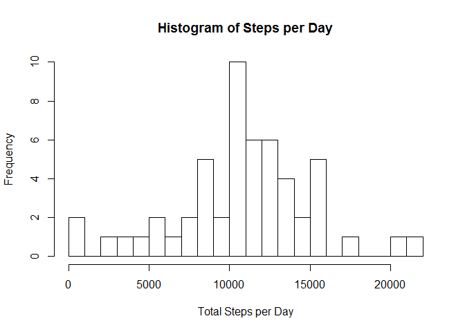
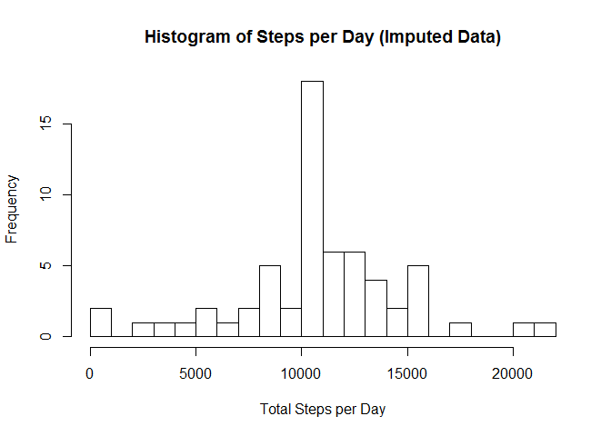
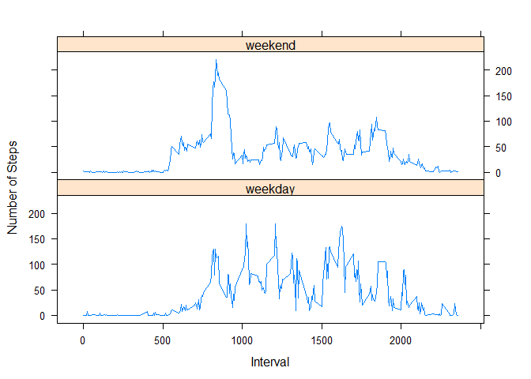

# Reproducible Research Peer Assignment 1
Elaine Stephens  
March 5, 2016  
## Overview
The goal of this analysis is to analys activity monitoring data.  The data set used is from a personal actiivty monitoring device. The device collects data at 5 minute intervals throughout the day. There are months of data (Oct and Nov 21012). The data is pre-aggregated into the number of steps taken in each 5 minute interval.

##Loading and Preprocessing the data

For the purposes of this assignment I have assumed that the file has been unzipped and placed in the working directory. I read it in and then set the date formatting on the date field


```r
stepData <- read.csv("activity.csv")
stepData$date <- as.POSIXct(stepData$date, format="%Y-%m-%d")
```

##What is mean total number of steps taken per day?

I will ignore the missing values in the data set for now. I will begin by aggregating the data up to the total steps per day. 


```r
totalSteps<-aggregate(steps~date,data=stepData,sum,na.rm=TRUE)
```

A histogram is helpful to visualize the data


```r
hist(totalSteps$steps,breaks=25, main="Histogram of Steps per Day", xlab="Total Steps per Day")
```



Now I will calculate the mean and median 


```r
meanSteps <- mean(totalSteps$steps, na.rm=TRUE)
meadianSteps <- median(totalSteps$steps, na.rm=TRUE)
```

- Mean number of steps per day: 1.0766189\times 10^{4}
- Meadian number of steps per day: 10765


##What is the average daily activity pattern?

I will create a time series plot of the 5-minute interval and the aaverage number of steps taken averaged across all days.

To do this I must first average all data in an interval together (regardless of date)


```r
stepsInterval <- aggregate(steps ~ interval, data = stepData, mean, na.rm = TRUE)
plot(steps ~ interval, data = stepsInterval, type = "l")
```


Now lets find out which interval on average across all the days in the dataset contains the maxium number of steps


```r
maxInterval <-  stepsInterval[which.max(stepsInterval$steps),]$interval
```

The max interval is 835

## Imputing Missing Values

Calculate the number of missing values in the data set


```r
 numMissing <- sum(is.na(stepData$steps))
```

There are 2304 values


I will impute the missing values by assigning the mean of all the values in that interval 


```r
meanForInterval <- function(interval){
        stepsInterval[stepsInterval$interval==interval,]$steps
        }

stepDataImputed <- stepData

for (i in 1:nrow(stepDataImputed)){
        if(is.na(stepDataImputed[i,]$steps)){
                stepDataImputed[i,]$steps <-meanForInterval(stepDataImputed[i,]$interval) 
        }
}
```

Now I will again agregate our data to a day and then make a histogram so I can visualize the impact of the imputed data as well as calculating the mean and median so that I can see the impact of how I imputed the data


```r
totalStepsImputed<-aggregate(steps~date,data=stepDataImputed,sum,na.rm=TRUE)

hist(totalStepsImputed$steps,breaks=25, main="Histogram of Steps per Day (Imputed Data)", xlab="Total Steps per Day")
```




```r
meanStepsImputed <- mean(totalStepsImputed$steps, na.rm=TRUE)
meadianStepsImputed <- median(totalStepsImputed$steps, na.rm=TRUE)
```

- Mean number of steps per day: 1.0766189\times 10^{4}
- Meadian number of steps per day: 1.0766189\times 10^{4}


The frequencies on the histogram are higher since we have more data values that we are plotting but since we used the mean values of each time period it had very little impact on the median and the mean was uneffected. 

## Are there differences in activity patterns between weekdays and weekends?

For this question I will be using the data set with the imputed values.

I will create a new factor varible with two levels "weekday" and "weekend"

Then I will create a panel plot containing time series plots of the 5 minute interval and average number of steps daken averaged across all weekdays or weekends 

```r
#Create a new factor varable that stores weekend or weekday
 stepDataImputed$dayType <- factor(weekdays(as.Date(stepDataImputed$date)) %in% c("Monday","Tuesday","Wednesday","Thursday","Friday","Saturday"), labels = c("weekday", "weekend"))
 
#aggregate up to the mean  
weekendWeekdayMean <- aggregate(x=list(stepDataImputed$steps), by=list(date=stepDataImputed$dayType, daytype=stepDataImputed$interval), FUN=mean )
colnames(weekendWeekdayMean) <- c("dayType","interval","averageSteps")
library(lattice)
xyplot(averageSteps ~ interval | dayType, data = weekendWeekdayMean, type="l", layout = c(1, 2), ylab="Number of Steps", xlab="Interval")
```


